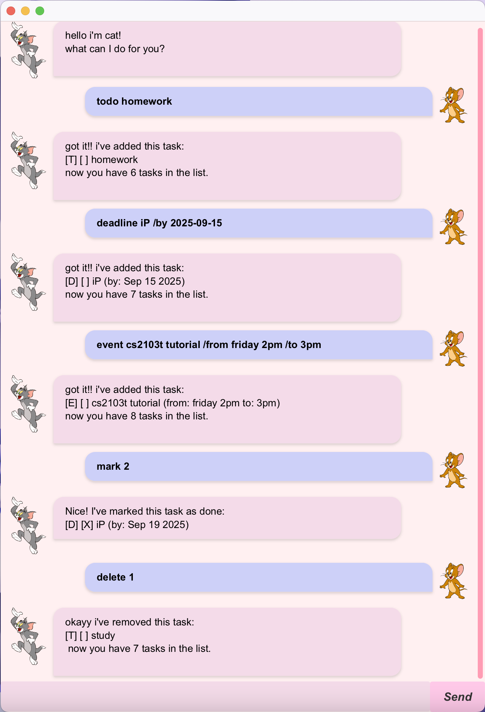

# Cat User Guide



Cat is a simple desktop chatbot that helps you keep track of tasks.  
It supports **todos, deadlines, events**, and comes with a friendly GUI built with JavaFX.

## Quick Start
1. Download the latest cat.jar file from the releases
2. Double-click the jar file to launch Cat
3. Type commands in the text box and press Enter or click "Send"
4. Cat will respond and help you manage your tasks!

## Adding todos

Adds a simple task without any date.
Useful for tracking tasks that don’t need scheduling.

Example: `todo read book`

Displays a confirmation that the task is added and lets you know how many tasks there are in total.

```
got it!! i've added this task:
[T][ ] read book
now you have 1 task in the list.
```

## Adding deadlines

Adds a task with a specific deadline date.
The task will include the description and a due date.

Example: `deadline submit report /by 2025-09-01`

Displays a confirmation that the task is added and lets you know how many tasks there are in total.

```
got it!! i've added this task:
[D][ ] submit report (by: Sep 1 2025)
now you have 2 tasks in the list.
```

## Adding events

Adds a task with both a start and end date.
Useful for events like meetings or trips.

Example: `event project meeting /from Monday 3pm /to 6pm`

Displays a confirmation that the task is added and lets you know how many tasks there are in total.

```
got it!! i've added this task:
[E][ ] project meeting (from: Monday 3pm to: 6pm)
now you have 3 tasks in the list.
```

## Marking tasks as done

Marks the task with the given index as completed.
The index is shown in the list.

Example: `mark 2`

Displays a confirmation that the task is marked as done.

```
nice! i've marked this task as done:
[D][X] submit report (by: Sep 1 2025)
```

## Unmarking tasks

Marks a previously completed task back as not done.

Example: `unmark 2`

Displays a confirmation that the task is marked as not done.

```
ok, i've marked this task as not done yet:
[D][ ] submit report (by: Sep 1 2025)
```

## Deleting tasks

Deletes the task at the given index.

Example: `delete 1`

Displays a confirmation that the task is deleted and lets you know how many tasks there are left.

```
okayy i've removed this task:
[T][ ] read book
now you have 2 tasks in the list.
```

## Listing all tasks

Displays all tasks currently stored.

Example: `list`

Displays all the tasks.

```
here are the tasks in your list!
1. [D][ ] submit report (by: Sep 1 2025)
2. [E][ ] project meeting (from: Sep 10 2025 to: Sep 11 2025)
```

## Searching for tasks

Finds all tasks containing the specified keyword in their description.

Example: `find report`

Displays all matching tasks.

```
here are the matching tasks in your list:
1. [D][ ] submit report (by: Sep 01 2025)
```

## Finding tasks due on a date

Shows all deadlines that are due on the given date.

Example: `due 2025-09-01`

Displays tasks due on the specified date.

```
[D][ ] submit report (by: Sep 1 2025)
```

### Troubleshooting
#### Cat won't start?
* Make sure you have Java 11 or later installed
* Try running from command line: java -jar cat.jar
#### Tasks not saving?
* Check that Cat has permission to create files in the folder where you're running it
* Cat saves tasks to a data folder in the same location as the jar file
#### Getting error messages?
* Check the command format matches the examples above
* Make sure dates are in the correct format (yyyy-MM-dd)
* Task numbers should be positive integers
<br>___<br>
##### Happy task managing with Cat!!!